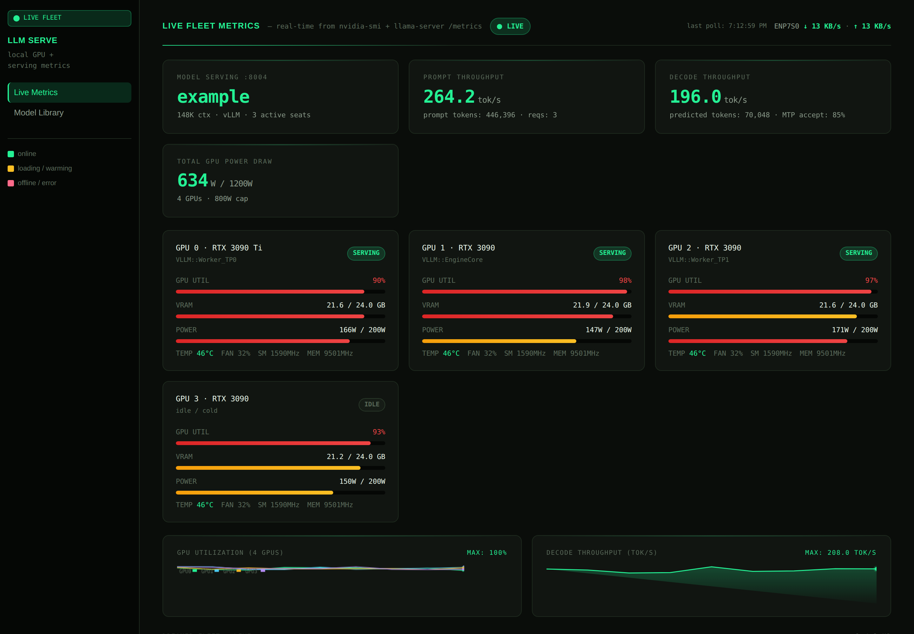

# LLM Serve Dashboard

A single-file, dependency-free live dashboard for your local LLM serving box — GPU utilization,
per-model throughput, KV/context fill, and system stats for **llama.cpp** and **vLLM**, in one
green terminal-styled page.

No framework, no build step, no external requests. The frontend is one `index.html` (opens on
`file://`); the backend is one stdlib Python file that reads `nvidia-smi` and each server's
Prometheus `/metrics`.



*(Screenshot rendered with example data — plug in your own box and it goes live.)*

## What it shows

- **GPUs** — per-card utilization, VRAM, power, temperature, clocks, and the actual compute
  tenants on each card (pulled from `nvidia-smi --query-compute-apps`, so cards are labeled from
  ground truth, not VRAM guesswork).
- **Primary worker** — decode & prefill tokens/sec, request counts, context/KV fill, LoRA
  adapters. Works with llama.cpp (`/metrics` + `/props`) and vLLM (`/metrics` + `/v1/models`).
  The worker port is **auto-discovered** from listening sockets, so a bench or swap that moves the
  model to another port still lands on the dashboard.
- **Secondary servers** — an optional row of cards for extra CPU/GPU llama-servers you run (point
  them at any endpoints — a small CPU model, a second box, etc.). Configure with `SECONDARY_SERVERS`.
- **System** — CPU, RAM, load, network, disk.
- **Model library** — a browsable inventory of your loadable models with quant, ctx, and measured
  throughput, driven by a JSON registry you edit.
- **Reasoning tap (optional)** — live per-request reasoning/CoT panels, if you tee a model's
  `reasoning_content` to a log (see `THOUGHT_LOG` below). Off by default.

## Run it

Requirements: Python 3.8+ and `nvidia-smi` (NVIDIA GPUs). No pip installs.

```bash
# 1. start the metrics endpoint (serves JSON on :8092)
python3 fleet-metrics.py

# 2. open the dashboard
xdg-open index.html      # or just double-click it / open in a browser
```

The page polls `http://localhost:8092` for live data. That's it.

### Point it at your servers

By default it looks for a llama.cpp/vLLM server on `:8001` (then `:8010`, `:8123`). Override:

```bash
# candidate ports for the primary worker (first responder with the largest ctx wins)
WORKER_PORT_CANDIDATES=8000,8001,8080 python3 fleet-metrics.py

# secondary servers shown as extra cards: name:port,name:port
SECONDARY_SERVERS='cpu-a:9093,box2:9001' python3 fleet-metrics.py

# model library source (defaults to the bundled models-registry.json)
MODELS_REGISTRY=~/my-models.json python3 fleet-metrics.py

# optional reasoning/CoT panel: tail a log of streamed reasoning_content
THOUGHT_LOG=~/thinking.log python3 fleet-metrics.py
```

Also update the matching `DREAMER_META` list near the bottom of `index.html` so the secondary
cards render with your names.

## How it works

`fleet-metrics.py` is a tiny `http.server` on `:8092` exposing:

- `GET /metrics` — the full JSON blob the dashboard renders (GPUs, worker, secondaries, system).
- `GET /models` — the model-library registry.
- `GET /health` — liveness.

llama.cpp exposes Prometheus counters at `/metrics`; the server derives per-second rates from the
cumulative counters. vLLM's cumulative counters are handled the same way. All parsing is stdlib.

## Python or Rust? Two builds

This repo is the **Python build** — the zero-setup, read-the-whole-thing-in-one-file version. There
is also a **Rust build, [fleet-tap](https://github.com/NHClimber87/fleet-tap)**, which is a
transparent traffic *tap* rather than just a metrics scraper. They render the same dashboard; they
differ in how they get the numbers and what they cost to run.

**Use the Python build (this repo) when:**
- You want it running in ten seconds: `python3 fleet-metrics.py`, no toolchain, no compile step.
- You watch one box with one or a handful of servers.
- You'd rather read and hack a single stdlib file than a Rust crate.
- You don't want anything sitting in front of your serving ports — this only ever *reads* each
  server's `/metrics`, never proxies traffic.

**Use the Rust build ([fleet-tap](https://github.com/NHClimber87/fleet-tap)) when:**
- You want **accurate, client-measured throughput.** It measures real tokens/sec from the actual
  request/response stream it taps, instead of scraping llama.cpp's `predicted_tokens_seconds` gauge
  (which reads 0 whenever the model is idle between generations).
- You run **many endpoints** and want live per-endpoint traffic streaming, **SSE push** (the browser
  stops polling), and **on-disk retention/history**.
- You want a single compiled binary with hot-reloadable config (add an endpoint, no restart).
- You accept the tradeoff: fleet-tap works by **holding each canonical serving port and forwarding
  to the engine on `port+10000`**, so it's a bit more setup and it sits in the request path (a
  fleet-tap crash interrupts serving until it restarts). Fine on a box you fully control; more than
  a casual "just show me the GPUs" tool needs.

Short version: **Python for the quick, side-car glance at one box; Rust for the always-on tap on a
busy multi-model rig.**

## Notes

- **Local-first / no phone-home.** No CDNs, no web fonts, no analytics. Everything is served from
  your box; the page makes exactly one request, to `localhost:8092`.
- The metrics server binds `0.0.0.0:8092` and sets permissive CORS so the `file://` page can read
  it. If you expose the box, put it behind your own auth/tunnel — it's read-only telemetry, but
  it's unauthenticated by design for local use.

## License

MIT — see [LICENSE](LICENSE).
